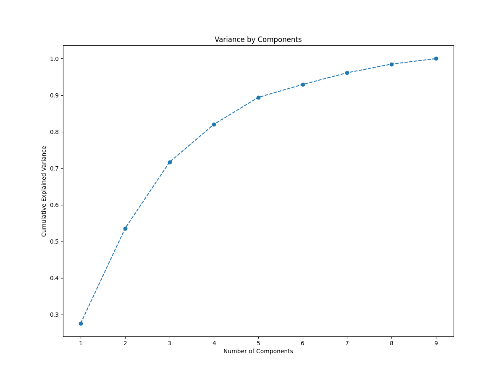
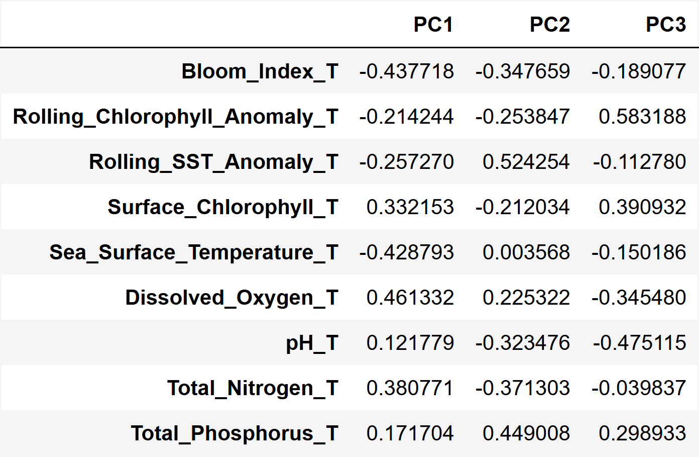
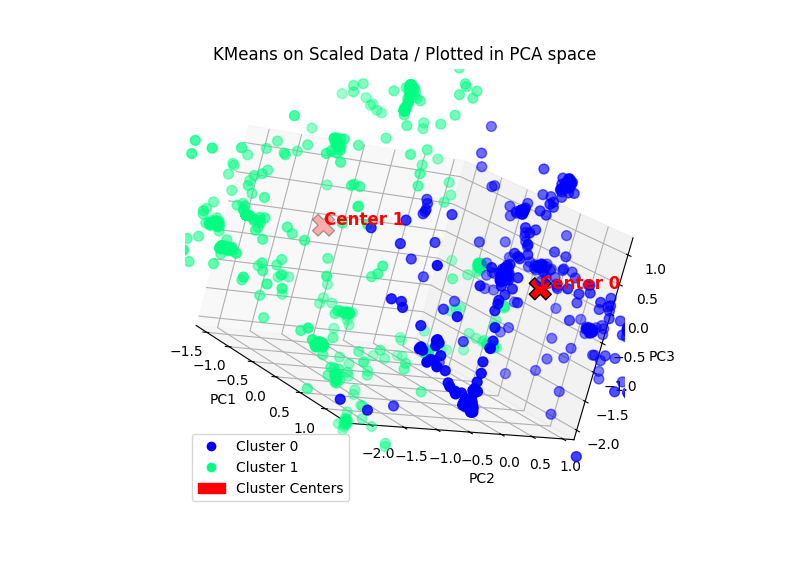
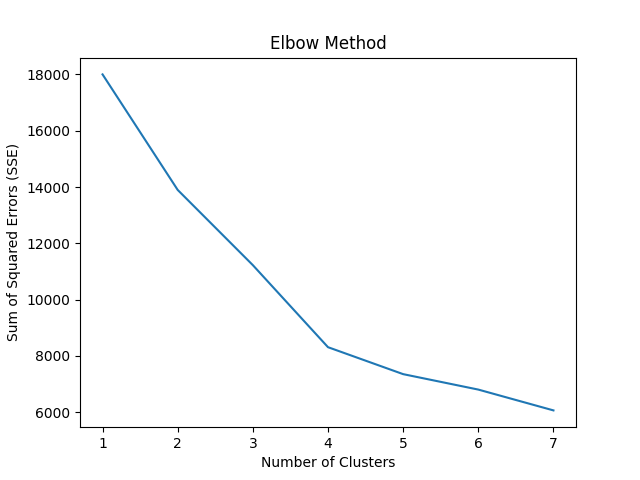
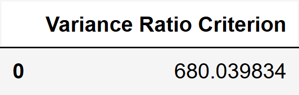
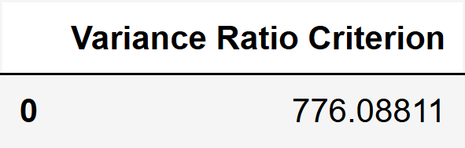
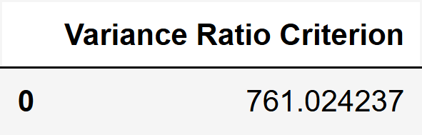
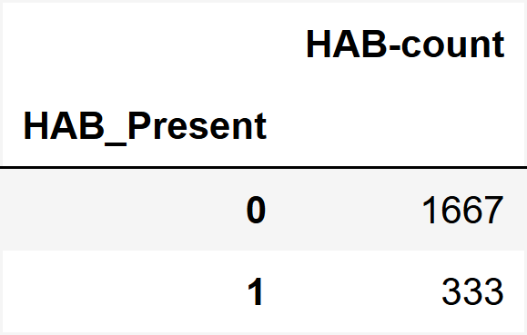
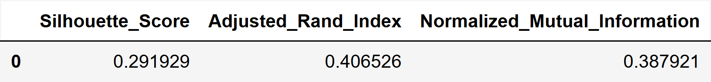

# K-Means Clustering

This model was chosen to compare the performance of an unsupervised model with that of a labeled dataset. K-Means is relatively simplistic and efficient compared to other unsupervised models and allows for the segmentation of data into clusters. The resulting clusters work well for our use case, since our ground truth labeled data is binary. Meaning, the labels from the KMeans model can be compared against the ground truth labels and additional metrics can be used to verify their similarity.

Some limitations of this model include difficulties with datasets with many features. However, Principal Components Analysis (PCA) and other dimension reduction methods can be employed to mitigate this issue. Another limitation is that the resulting centroids may be heavily influenced by outliers. It is generally recommended to identify and remove these outliers during data preprocessing to avoid this.

### Hyperparameters

#### random_state

A random seed is used when reproducibility is desired. The value of 0 is used for completely random. When a specific value is chosen ensures deterministic results.For this project, the value 42 was chosen to ensure reproducibility of the results, but also because of the number's famous pop culture reference in the Computer Science domain.

#### n_clusters

Used to determine the number of clusters the model must create. Using the [Elbow Method](#elbow-method) is a common way to identify the optimal number of clusters for the dataset. More detailed information can be found on this in the [Additional Concepts](#additional-concepts) and [Resource](#resources) sections.

#### algorithm

Allows a user to choose k-means algorithm to use. The choices are Lloyd or Elkan. Lloyd is the default, but Elkan uses triangle inequality, thus working better with datasets that have well-defined clusters. For our use case we went with the default as it is adequate for a dataset.

#### n_init

Specifies the number of times the k-means algorithm is run with different centroid seeds and the best result is returned. Modifying this number had little to no effect on the data so the last value used (9) is what was chosen.s

## How K-Means works

1. Define number of clusters
2. Randomly select datapoints (for initial clusters)
3. Measure distance between first initial cluster and the other (Euclidian distance)
4. Assign first point to the nearest cluster centroid

   a. Repeat steps 3 and 4 for each point

5. Calculate mean point of each cluster
6. Repeat steps 3 and 5 using the mean values
7. Repeat step 6 until no further changes occur to the datapoints.

## Additional Concepts

### Elbow Method

The Elbow Method is simply the process of creating a plot with the number of clusters on the x-axis and the total sum of squared errors (SSE) on the y-axis. Then, identify where a bend appears in the plot if multiple bends exist, choosing the first one or the bend that shows the most significant change from high to low slope (i.e., becoming flat). However, the Elbow Method is considered too subjective and typically requires complementation from another statistical metric, such as the Variance Ratio Criterion.

### Scaling

Since the data we use has high variance among the range and unit measurements (e.g., Temperature vs pH), scaling is required to prevent any single feature from having more influence on the data than the others.

### Principal Components Analysis (PCA)

PCA is used to reduce the dimensionality of the data set by reducing the number of variables. This is done by applying a linear transformation to the features of the passed in dataset and creating new features labeled "Components." After this transformation, the output can be analyzed to show the variance returned. According to some sources, 70-80% of variance is an acceptable cut off.

Each number represents how much an original feature contributes to a given PCA component.

- `Magnitude` indicates how strong of an influence a feature has on that component

- Direction of the relationship

  - `Positive` score means the feature increases the component score

  - `Negative` score means the feature decreases the component score

## Metrics

### Silhouette Score

The Silhouette Score evaluates how well each data point fits within its assigned cluster, and how distinctly separated it is from other clusters. Values range between -1 and 1.
A 1 means the data point fits very well in its own cluster. 0 indicates the data point is between clusters or the clusters are overlapping. -1 means the data point is in the wrong cluster.

### Normalized Mutual Index (NMI)

NMI measures the amount of shared information between the predicted clusters and the true clusters. Ranging from 0 to 1 where 1 is high similarity and 0 is no similarity.

### Adjusted Rand Index (ARI)

ARI computes another similarity metric used to measure two clusterings, adjusted for chance. Useful for determining the agreement of results between two methods or against ground truth data. A value of 1.0 indicates perfect match, a value of 0 indicates agreement equivilent to randomness, and a negative value indicates (up to -1) indicates severe disagreement. Considered more robust than NMI.

### Variance Ratio Criterion (Calinski–Harabasz index)

An evaluation metric where the assessment of the clustering quality is based solely on the dataset and the clustering results, and not on external, ground truth labels.

## Training Process

For this project, the Scikit-Learn library was chosen over frameworks like PyTorch or TensorFlow. One primary reason is its simplicity, familiarity from prior use, and the availability of all the necessary methods for the chosen model, which prevents the need to create the model from scratch. Instead, passing in the desired hyperparameter values dictates how the model behaves.

## Workflow

1. Import the dataset. If data contains labeled data, ensure the ground truth column is ignored or dropped for future processing.
2. Transform data using a scaler.
3. Use PCA to identify component variance.
4. Use Elbow Method to identify optimum n_clusters (Optional if desired cluster size is known).
5. Use VRC to complement the Elbow Method for determing the optimum number of clusters.
6. Use K-Means on the scaled data.
7. Plot KMeans points in PCA Space (for easier visualization with 3D/2D graphs)
8. Perform evaluation through various metrics.

## Results

#### PCA and Visualization

One way to improve data visualization, improve computational efficiency, and condense high-dimensional datasets is through dimensionality reduction methods such as Principal Component Analysis (PCA). By maximizing the amount of information in each consecutive component, new features created by combining the initial features, allow our dataset to be reduced to only a few components that capture most of the necessary information from the original features. In the dataset used for this project, we had 9 features, but with PCA, we reduced it to 3 while retaining over 70% of the original information. This enabled the 3D visualization of the data points in PCA space as a scatter plot.

<figure>
    
    <figcaption><b>Figure 1</b>: Shows the variance levels by component from PCA.
</figcaption>
</figure>

<figure>
    
    <figcaption><b>Figure 2</b>: The loadings, feature values that have a strong correlation with each component.
</figcaption>
</figure>

<figure>
    
    <figcaption><b>Figure 3</b>: The 3D visualization of the KMeans clusters in PCA space.
</figcaption>
</figure>

#### Elbow Method and VRC

The Elbow Method and Variance Ratio Criterion (VRC) revealed that 4 is the optimal number of clusters for the dataset. However, for our use case of comparing the model against the existing ground truth labels (i.e., HAB_Present: yes or no), we simply used performed these metrics as a formality, since we were going to use 2 clusters regardless of the results. Interestingly, the results from these metrics could imply that more complex classifications may exist for the data. Instead of simply identifying whether an algal bloom is present, the additional clusters could indicate that an algal bloom is approaching the early or later stages. More analysis and experimentation with this dataset would be required to determine whether this hypothesis is true.

<figure>
    
    <figcaption><b>Figure 4</b>: The bends from the Elbow Method. Four clusters is considered optimal. 
</figcaption>
</figure>

<table>
  <caption><b>Table 1</b>: The Variance Ration Criterion from KMeans clustering results in order of 2, 3, 4, and 5 clusters. Note that higher values indicate better clustering. 
  </caption>
  <tr>
    <td></td>
    <td></td>
    <td></td>
    <td></td>
  </tr>
</table>

#### Evaluation Metrics

The evaluation metrics performed on the KMeans clusters were the Silhouette, ARI, and NMI scores. The Silhouette score of 0.29 indicates weak separation. An Adjusted Rand Index (ARI) of .41 (rounded up) indicates that there is a moderate similarity between the KMeans clusters and the ground truth clusters. Similarly, the Normalized Mutual Index (NMI) score of .39 (rounded up) also indicates moderate agreement between the predicted and ground truth clusters. This is indicative that the model did "decent" enough, but there is room for improvement.

<table>
  <caption><b>Table 2</b>: The clustering count of the ground truth and KMeans. 
  </caption>
  <tr>
    <td style="padding-left: 40px;"></td>
    <td></td>

  </tr>
</table>

<figure>
    
    <figcaption><b>Figure 5</b>: The evaluation metrics on the clustering from the KMeans ML Model (with 2 clusters) against the ground truth. 
</figcaption>
</figure>

## Summary

For our project, we chose K-Means clustering as an unsupervised machine learning method to compare its cluster assignments with existing binary ground truth labels from the HAB dataset. K-Means was chosen for its simplicity, efficiency, and suitability for splitting data into distinct groups. Our workflow involved scaling the data, reducing dimensionality with PCA, determining the number of clusters using the Elbow Method and Variance Ratio Criterion (VRC), fitting K-Means, visualizing in PCA space, and evaluating with multiple metrics.

Using PCA reduced the dataset from 9 features to 3 components, retaining over 70% of the variance and enabled effective 3D visualization. Although the Elbow Method and VRC metrics suggested 4 optimal clusters, the HAB dataset constrained us to use the KMeans model with 2 clusters to align with ground truth labels; However, those results hint at potential sub-classes within the dataset. The other evaluation metrics, Silhouette Score (0.29), ARI (0.41), and NMI (0.39), show weak cluster separation but moderate agreement between predicted clusters and ground truth, indicating reasonable but improvable performance.

Overall, the model provides a useful baseline for unsupervised comparison and hints at more nuanced classifications within the dataset.

# Resources

[Scikit-learn: KMeans](https://scikit-learn.org/stable/modules/generated/sklearn.cluster.KMeans.html#sklearn.cluster.KMeans)

[K-Means Clustering Algorithm with Python](https://www.youtube.com/watch?v=iNlZ3IU5Ffw&t=53s)

[Elbow Method to Find Optimal Clusters](https://www.statology.org/elbow-method-in-python/)

[What is Silhouette Score?](https://www.geeksforgeeks.org/machine-learning/what-is-silhouette-score/)

[K-Means with PCA Dimensionality Reduction](https://www.stepbystepdatascience.com/k-means-and-pca-in-python-with-sklearn)

[What is PCA?](https://365datascience.com/tutorials/python-tutorials/principal-components-analysis/)

[Clustering Centroids](https://pythonprogramminglanguage.com/kmeans-clustering-centroid/index.html)

[3D Plotting with KMeans](https://stackoverflow.com/questions/64987810/3d-plotting-of-a-dataset-that-uses-k-means)

[Clustering Performance Metrics](https://medium.com/@Sunil_Kumawat/performance-metrics-for-clustering-9badee0b7db8)

[K-Means Pros and Cons](https://developers.google.com/machine-learning/clustering/kmeans/advantages-disadvantages)
